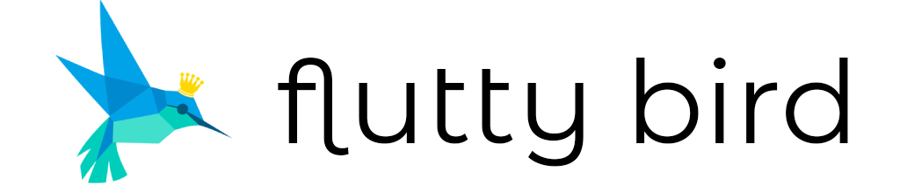

# Flutty Bird

Addictive "Flappy bird" game implemented in Flutter with Flutter-inspired graphics.

## Rules

The rules are very simple. Tap the screen to jump and conquer gravity. Evade the obstacles coming your way and survive for as long as possible. Touching any of the obstacles or hitting the ceiling of floor, you die.

You can also pause the game while playing and come back later, as long as you do not close the app.

## Obstacle generation

Obstacles are generated so that distance between them is constant. The holes are always the same height, however their location is chosen completely randomly, but at least some distance away from top and bottom.

## Best score

Best score is saved to device storage using [`shared_preferences`](https://pub.dev/packages/shared_preferences) Flutter plugin, which uses `NSUserDefaults` on iOS and `SharedPreferences` on Android.

## Application

### iOS

### Android

